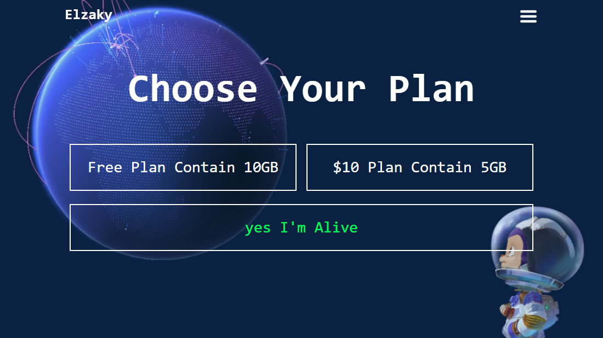

# Ahmed Elzaky
**`Front End Developer (Digital Craftsman)`**

# 
### 🧰 Languages and Tools

 

# 
### Top Projects' Demos
<figure>
  
   
  <figcaption><a href="https://github.com/Ahmed-Elzaky/Template-Zero">Template Zero</a></figcaption>
</figure>

# 
### Top Repositories

# 

# 

