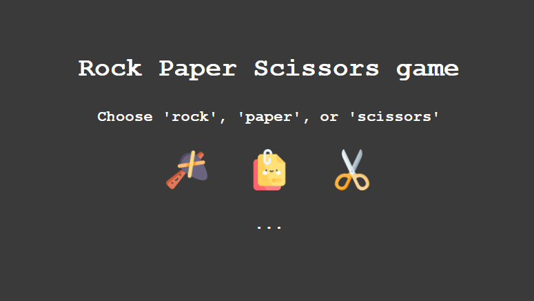

# Ahmed Elzaky 

**`Front End Developer (Digital Craftsman)`**

### Languages and Tools
<!-- <kbd> -->

<!-- </kbd> -->

 
 

### Top Projects' Demos
<!-- <figure>
  
   
  <figcaption><a href="https://github.com/Ahmed-Elzaky/Template-Zero">Template-Zero</a></figcaption>
</figure>
<figure>
  
   
  <figcaption><a href="https://github.com/Ahmed-Elzaky/Template-Zero">Template-Zero</a></figcaption>
</figure> -->
<!-- <kbd> -->

<!--  </kbd> -->

 
 

### Top Repositories

 
 

### Most Used Languages

